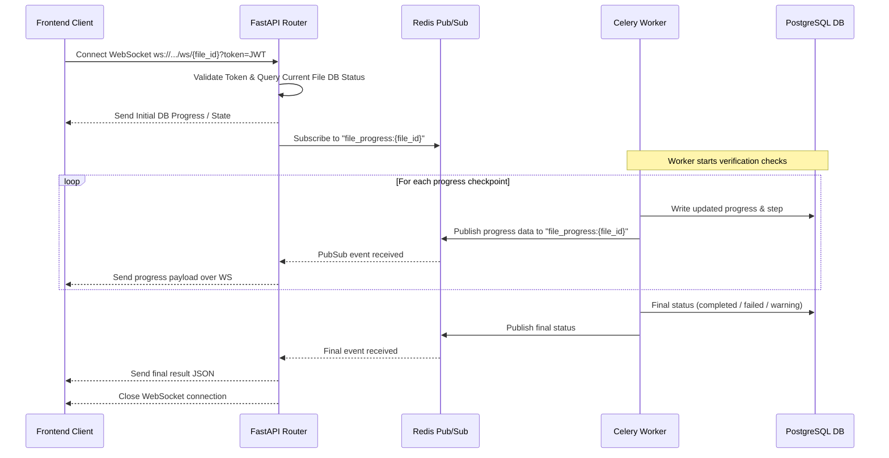
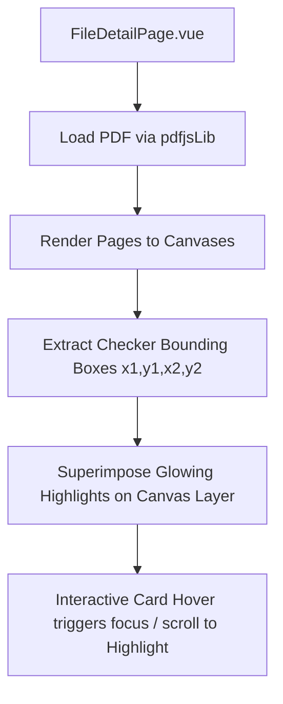

# Implementation Plan - Core Platform Enhancements

This document outlines the design and step-by-step implementation plan for introducing Alembic database migrations, WebSocket-based real-time progress updates, and interactive inline PDF.js rendering with bounding box highlighting for PPAP document anomalies.

---

## User Review Required

> [!IMPORTANT]
> - **Alembic Database State**: The database already has tables initialized manually via SQLAlchemy `Base.metadata.create_all` on startup. To transition to Alembic smoothly, we will first create an initial revision matching the current model definitions and stamp the database to sync the state without executing actual CREATE TABLE statements on the existing live database.
> - **WebSocket Gateway Port**: The WebSocket connection will operate on the same port as the FastAPI backend (`8000`). If the frontend is deployed in staging behind a reverse proxy, WebSocket protocol routing (`ws`/`wss`) must be supported.
> - **PDF.js CDN/Library Support**: Since `pdfjs-dist` version `4.0.379` is already declared in `package.json`, we will configure the PDF.js library with local worker assets loaded inside Vite without relying on external CDNs, ensuring complete localized offline operations.

---

## Proposed Changes

We will execute the implementation in three independent milestones corresponding to the three target priorities.

### Milestone 1: P0 - Alembic Database Migrations Setup

Configure Alembic for managing schema changes physically over PostgreSQL.

#### [NEW] [alembic.ini](file:///Users/zhouao/Projects/WorkSpace/Enter-Bro/ppap/backend/alembic.ini)
- Alembic configuration file containing settings, log formatters, and connection specifications. The connection URL will be populated dynamically from environment variables inside `env.py`.

#### [NEW] [env.py](file:///Users/zhouao/Projects/WorkSpace/Enter-Bro/ppap/backend/migrations/env.py)
- Setup the migrations running script using the `async` templates.
- Dynamically inject the PostgreSQL connection URL from the backend's core configuration (`settings.DATABASE_URL`).
- Register target metadata (`Base.metadata`) by importing the core SQLAlchemy models.

#### [MODIFY] [main.py](file:///Users/zhouao/Projects/WorkSpace/Enter-Bro/ppap/backend/app/main.py)
- Refactor the database startup block: disable `Base.metadata.create_all` and print a notice for Alembic-managed migrations, or invoke automatic migrations programmatically via `alembic.command.upgrade` during application startup in the FastAPI lifespan.

---

### Milestone 2: P1 - WebSocket Real-Time Progress Channel

Introduce asynchronous server-to-client updates for the Celery verification pipeline using Redis PubSub.



#### [MODIFY] [verification_tasks.py](file:///Users/zhouao/Projects/WorkSpace/Enter-Bro/ppap/backend/app/tasks/verification_tasks.py)
- Publish real-time checkpoints (`progress`, `status`, and `current_step`) to Redis PubSub using the `file_progress:{file_id}` channel in each verification stage.

#### [NEW] [websocket.py](file:///Users/zhouao/Projects/WorkSpace/Enter-Bro/ppap/backend/app/api/websocket.py)
- Define a FastAPI WebSocket router.
- Implement token-based query parameter authentication.
- Read current database status for immediate response, and subscribe to Redis PubSub to stream active progress updates.

#### [MODIFY] [api_router](file:///Users/zhouao/Projects/WorkSpace/Enter-Bro/ppap/backend/app/api/__init__.py)
- Mount the websocket router under the API endpoint registry.

#### [MODIFY] [FileDetailPage.vue](file:///Users/zhouao/Projects/WorkSpace/Enter-Bro/ppap/frontend/src/views/FileDetailPage.vue)
- Refactor `startPolling` to try initiating a WebSocket connection first.
- Update reactive properties (`file.verification_progress`, `file.status`) based on WebSocket message payloads.
- Automatically refresh document logs, checkers and notes list on check completion.
- Fallback seamlessly to standard HTTP polling if the WebSocket server is unreachable or disconnects prematurely.

---

### Milestone 3: P2 - PDF.js Inline Rendering and Bounding Box Highlighting

Enable interactive document preview with localized highlight overlays based on parsed spatial coordinates.



#### [MODIFY] [qr_decoder.py](file:///Users/zhouao/Projects/WorkSpace/Enter-Bro/ppap/backend/app/checkers/qr_decoder.py)
- Extract coordinates (`bbox`) from OpenCV's `detectAndDecode` output.
- Translate 200 DPI image pixels back to Standard 72 DPI PDF coordinates.
- Return spatial markers `[x1, y1, x2, y2]` along with page index.

#### [MODIFY] [sig_verifier.py](file:///Users/zhouao/Projects/WorkSpace/Enter-Bro/ppap/backend/app/checkers/sig_verifier.py)
- Use PyMuPDF (`fitz`) within `verify_pdf_signatures` to resolve the coordinate boundary box (`widget.rect`) of digital signature visual elements and return page coordinates.

#### [MODIFY] [FileDetailPage.vue](file:///Users/zhouao/Projects/WorkSpace/Enter-Bro/ppap/frontend/src/views/FileDetailPage.vue)
- Embed a beautiful 40/60 horizontal split panel showing the interactive PDF Viewer side-by-side with rules diagnostics report.
- Setup a canvas renderer utilizing `pdfjs-dist` to render pages sequentially.
- Overlay responsive, absolute positioned `div` markers that draw glowing green/warning borders around verified barcodes and signatures on hover or focus of diagnostic check items.

---

## Verification Plan

### Automated & Integration Tests
1. **Alembic Migrations Verification**:
   - Initialize database, auto-generate initial schema version:
     ```bash
     alembic init -t async migrations
     alembic revision --autogenerate -m "initial_schema"
     alembic upgrade head
     ```
   - Verify all Postgres tables (`users`, `files`, `tasks`, etc.) are mapped and generated correctly.
2. **WebSocket Integration Test**:
   - Run `python e2e_test.py` and inspect if the FastAPI backend logs WebSocket connections and successfully broadcasts pubsub events.
3. **Checkers Coordinates Test**:
   - Run `python verify_test.py` and confirm that extracted coordinates for QR codes and signature rects are returned inside the result dictionary and contain floats.

### Manual Verification
- Upload files in the browser frontend and observe the glowing progress bar transition fluidly without clicking or HTTP polling.
- Check the PDF Preview frame inside `FileDetailPage.vue`, hover over the "QR Code Detected" or "Digital Signatures" card, and verify that the viewport scrolls to the corresponding section of the document and highlights the target area in a glowing neon box.
