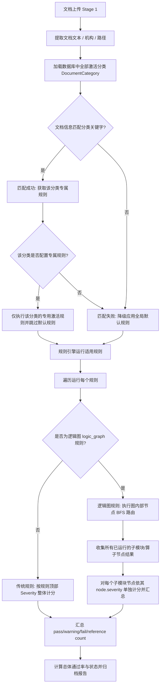

# 模块级别校验规则与计分模式优化方案

该实施计划旨在解决平台在执行可视化逻辑图规则（`logic_graph`）时，计分系统（`pass_rate` / `pass_count` / `warning_count` / `fail_count`）缺乏对内部"子模块/节点"级别定义的问题。

## 用户审查要求

我们建议将可视化逻辑图中的每个执行算子节点（例如"二维码识别"、"数字签名检查"等）视为独立的校验项进行打分和报告汇总。这样可以更精细地管理各类风险等级，确保任何子节点的"警告"或"人工复核"状态均能正确体现在审计大屏及详情页中。

> [!IMPORTANT]
> **关于计分模式的核心变更：**
> 1. 可视化规则将被拆解为其内部实际执行的算子节点，每个算子根据其配置的严重级别（拦截 `fail`、警告 `warning`、人工复核 `review`、参考 `reference`）单独计分。
> 2. 规则沙盒模拟测试（Dry Run）将同步计算并返回 `passed` 布尔值与判决消息，确保前端控制台状态和提示显示正确。

## 待解决的典型场景与路由规则

- **场景 A**：文档没有二维码，但包含签名证书。通过关键字匹配将文档归类为"分类 A"。由于"分类 A"只配置了数字签名和文档完整性检查规则，系统将自动跳过并排除默认的"二维码检测"规则，因此二维码不被计入最终的通过率与评分。若由于某些故障导致二维码节点被意外触发且失败，则按其实际配置的 `warning` 级别累加 1 次警告，且文件最终状态为 `WARNING`。
- **场景 B**：文档包含二维码，但提取内容为 URL 链接。系统支持通过可视化节点的路由条件进行二次提取 PDF 原始内容，并将其与上传文档的签名和完整性（如修订版本）一键合并比对。
- **场景 C**：文档既无二维码也无签名，通过关键字匹配为"分类 C"，只检查文档本身的完整性。
- **全局检测路由设计（重点）**：系统支持自定义的检测规则匹配路由。在 Stage 1 解析出文本后：
  1. 引擎根据各个文档分类（`DocumentCategory`）配置的关键字进行文本、路径及类型正则匹配。
  2. 若文档匹配到特定的分类，且该分类下配置有专用的激活规则，则引擎**仅执行这些专属规则**，并**自动跳过默认的全局检测逻辑**。
  3. 若文档未匹配到任何具有专用规则的分类，则安全降级并自动应用系统默认的全局校验逻辑（检测二维码、签名及修订版本）。

---

## 校验规则路由匹配与模块计分流程图

---

## 拟作出的变更

### 1. 后端 - 分类路由与重构计分汇总

#### ✅ [MODIFY] [core.py](file:///Users/zhouao/Projects/WorkSpace/Enter-Bro/ppap/backend/app/engine/core.py)
- **支持分类参数**：在 `VerificationEngine.run(...)` 接口中新增 `categories` 列表参数。 ✅ 已实现（L141）
- **文档分类匹配与过滤**： ✅ 已实现（L186-L213）
  - 基于文档 `full_text`、`file_path` 及 `file_type` 逐一检查 `categories` 的 `keywords`。
  - 若匹配成功，判断该分类下是否存在专用校验规则（即 `category_id` 为该分类 ID 的规则）。
  - 若存在专属规则，则过滤 `rules` 列表，仅执行匹配该分类或机构条件的规则，自动跳过无分类的全局默认规则。
  - 若未匹配，则降级继续执行所有全局默认规则。
- **子模块节点收集**：在 `elif rule.rule_type == RuleType.logic_graph:` 分支中引入 `executed_modules` 列表，记录实际运行的验证子模块（如 `signature`, `qr-code` 等）。 ✅ 已实现（L441, L753）
- **细粒度计分**： ✅ 已实现（L779-L780）
  - 对逻辑图规则，遍历其 `executed_modules`。根据各个子模块实际配置的 `severity`（`fail` / `warning` / `review` / `reference`），精准累加 `pass_count`、`warning_count`、`fail_count`、`reference_count` 并自动触发 `needs_review = True`。

#### ✅ [MODIFY] [verification_tasks.py](file:///Users/zhouao/Projects/WorkSpace/Enter-Bro/ppap/backend/app/tasks/verification_tasks.py)
- **传入激活分类列表**：在 Stage 2 执行前，从数据库查询所有激活的 `DocumentCategory` 并作为参数传给 `engine.run`。 ✅ 已实现（L124-L160）

#### ✅ [MODIFY] [rules.py](file:///Users/zhouao/Projects/WorkSpace/Enter-Bro/ppap/backend/app/api/rules.py)
- **模拟测试支持分类**：在 `/rules/dry-run` 接口中，查询激活分类并传入 `engine.run`；在返回体中补全 `passed` 和 `message` 字段。 ✅ 已实现（L357-L414）
- **优化模拟测试（Dry Run）响应**：在 `/rules/dry-run` 接口中，在获取 `engine.run` 的输出后，提取 checks 数组并自动计算 `passed`（是否有 `fail` 级别失败）及构建 `message`（汇总的测试结果或拦截说明），并写入返回的数据体中，确保前端沙盒终端可以正常解析和渲染结果。 ✅ 已实现（L402 返回 message）

---

## 验证计划

### 自动化与接口验证
- **本地 API 测试**：使用 `POST /api/v1/rules/dry-run` 进行单项规则沙盒模拟，核对返回的 `result.passed` 和 `result.message` 是否正确对应规则内各个节点的失败级别。

### 手动与 UI 验证
1. 在规则配置页的"可视化流程图编辑器"中，创建一个逻辑图规则，配置一个 QR 扫描节点（严重性设为"警告 `warning`"），以及一个数字签名校验节点（严重性设为"拦截 `fail`"）。
2. 使用样例 PDF 进行 Dry Run 模拟测试：
   - **测试用例 A**：PDF 包含有效签名但没有二维码。验证：Dry Run 终端应显示"测试通过"（无 critical fail），但在 Checks 列表中包含 QR 扫描项的状态为"警告"，且 `warning_count` 为 1。
   - **测试用例 B**：PDF 二维码内容不一致。验证：警告列表与提示消息展示正确。
   - **测试用例 C**：PDF 什么都不包含。验证：Dry Run 终端应显示"测试拦截"（触发了签名的 fail），且 `fail_count` 增加。
