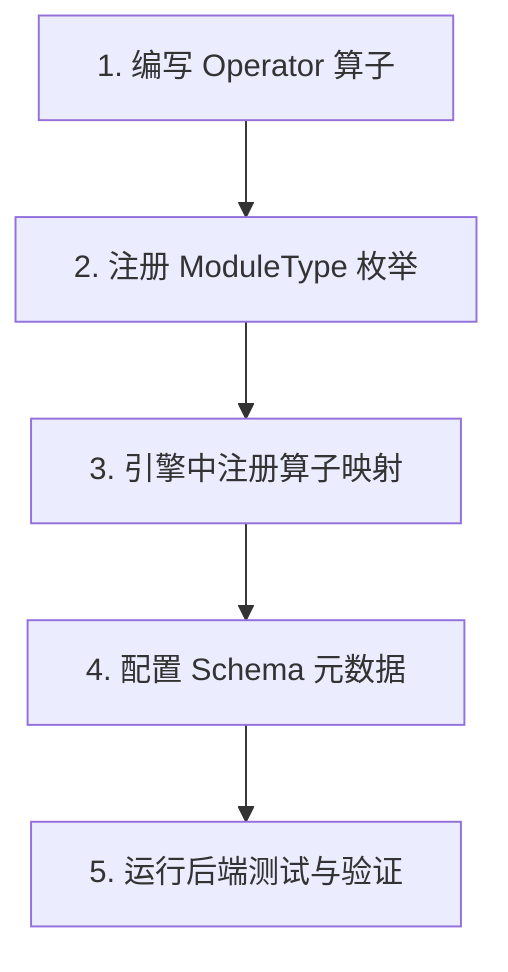

# 新校验模块开发指南 (Add New Verification Module Guide)

PPAP 平台基于“算子 - 校验模块 (Operator - Verification Module)”的插拔式架构设计。添加一个全新的校验模块非常简单，系统会通过配置元数据自动在前端生成对应的配置表单，无需编写任何前端页面。

本指南将详细介绍如何开发并向系统中注册一个新的校验模块。

---

## 开发路线图 (Roadmap)



---

## 1. 详细开发步骤

### 第一步：编写 Operator 算子
在 `backend/app/engine/operators/` 下新建一个算子文件，命名为 `[my_feature]_operator.py`。
算子类需要继承 `BaseOperator`，并实现以下三个核心接口：
1. `provides`：声明该算子会在 `DocumentContext.shared_state` 中写入的键名。
2. `requires`：声明该算子正常运行所依赖的上下文键名（例如需要依赖 `qr_codes` 才能运行）。
3. `execute`：执行具体的校验逻辑。

**示例代码：**
```python
# backend/app/engine/operators/my_feature_operator.py
from typing import List
from app.engine.base import BaseOperator, DocumentContext, OperatorResult

class MyFeatureOperator(BaseOperator):
    def __init__(self):
        super().__init__(name="MyFeature")  # 算子在引擎中的唯一标识名称

    @property
    def requires(self) -> List[str]:
        # 依赖其他算子提取的数据，如果不需要，返回空列表 []
        return []

    @property
    def provides(self) -> List[str]:
        # 写入 context 供后续算子使用的字段名
        return ["my_extracted_feature"]

    async def execute(self, context: DocumentContext, **kwargs) -> OperatorResult:
        # kwargs 接收用户在前端配置的参数（例如：threshold_value）
        threshold = kwargs.get("threshold_value", 50)
        
        # 执行具体计算
        passed = True
        extracted_value = 100
        
        if extracted_value < threshold:
            passed = False
            msg = f"校验失败：当前值 {extracted_value} 低于预设阈值 {threshold}。"
        else:
            msg = f"校验通过：当前值 {extracted_value} 满足阈值要求。"
            
        # 将结果存入共享状态
        context.shared_state["my_extracted_feature"] = extracted_value

        return OperatorResult(
            operator_name=self.name,
            pass_status=passed,
            confidence=1.0,
            message=msg,
            extracted_data={
                "value": extracted_value,
                "threshold": threshold
            }
        )
```

---

### 第二步：注册 `ModuleType` 枚举
我们需要在模型定义和 API Schema 中同步注册该类型，使系统支持其持久化与传输。

#### 1. 修改模型层枚举
修改 [verification_module.py (Model)](file:///Users/zhouao/Documents/GitHub/ppap/backend/app/models/verification_module.py#L9-L27)，在 `ModuleType` 中追加你的模块标识：
```python
class ModuleType(str, enum.Enum):
    # ... 已有模块 ...
    online_verification = "online_verification"
    my_feature = "my_feature"  # <-- 新增项
```

#### 2. 修改 Schema 层枚举
修改 [verification_module.py (Schema)](file:///Users/zhouao/Documents/GitHub/ppap/backend/app/schemas/verification_module.py#L6-L23)，在 `ModuleType` 中同步追加：
```python
class ModuleType(str, Enum):
    # ... 已有模块 ...
    online_verification = "online_verification"
    my_feature = "my_feature"  # <-- 新增项
```

---

### 第三步：引擎中注册算子与映射
修改 [core.py](file:///Users/zhouao/Documents/GitHub/ppap/backend/app/engine/core.py)：
1. 导入你编写的算子类。
2. 在 `VerificationEngine.__init__` 中的 `_available_operators` 字典中注册算子实例。
3. 在 `_get_operator_for_module_type` 中，将 `ModuleType.my_feature` 映射到你的算子注册名。

**修改示例：**
```diff
# backend/app/engine/core.py

+ from app.engine.operators.my_feature_operator import MyFeatureOperator

class VerificationEngine:
    def __init__(self):
        self._available_operators = {
            # ...
            "OnlineVerification": OnlineVerificationOperator(),
+           "MyFeature": MyFeatureOperator(),
        }

    def _get_operator_for_module_type(self, module_type: ModuleType) -> Optional[BaseOperator]:
        module_to_operator = {
            # ...
            ModuleType.online_verification: "OnlineVerification",
+           ModuleType.my_feature: "MyFeature",
        }
```

---

### 第四步：配置 Schema 元数据 (动态表单渲染)
PPAP 平台前端会直接读取后端的 Schema 定义，根据 `MODULE_TYPE_METADATA` 自动渲染配置选项和输入表单。
修改 [verification_module.py (Schema)](file:///Users/zhouao/Documents/GitHub/ppap/backend/app/schemas/verification_module.py)，在 `MODULE_TYPE_METADATA` 中添加配置项：

```python
MODULE_TYPE_METADATA = {
    # ... 已有模块 ...
    "my_feature": {
        "label": "我的自定义校验",
        "description": "这是我自定义开发的校验功能，支持阈值设定",
        "icon": "🚀",
        "config_fields": [
            {
                "key": "threshold_value", 
                "label": "过滤阈值", 
                "type": "number", 
                "default": 50,
                "description": "请输入进行判定所需的阈值数值"
            },
            {
                "key": "match_rule",
                "label": "匹配规则",
                "type": "text",
                "default": "default_rule"
            }
        ]
    }
}
```

#### 配置字段类型参数说明
`config_fields` 内的每个字段对象支持以下属性：
*   `key`: 传递给 Python 算子 `kwargs` 的参数名。
*   `label`: 前端表单中显示的标签名。
*   `type`: 输入框类型。支持 `text` (文本输入)、`number` (数字输入)、`textarea` (多行文本) 等。
*   `default`: 默认值。

配置完成后，用户在规则配置页面创建新模块时，选择“我的自定义校验”，右侧配置区域将自动渲染出包含“过滤阈值”和“匹配规则”两个输入框的表单！

---

## 2. 测试与验证

开发完新算子后，必须编写单元测试来保障其稳定运行。

### 编写单元测试
在 `backend/tests/engine/` 目录下（如 `test_my_feature_operator.py`）添加对算子的测试：

```python
import pytest
from app.engine.base import DocumentContext
from app.engine.operators.my_feature_operator import MyFeatureOperator

@pytest.mark.asyncio
async def test_my_feature_operator():
    context = DocumentContext(file_path="test.pdf")
    op = MyFeatureOperator()
    
    # 模拟前端传入配置为 threshold_value = 80
    result = await op.execute(context, threshold_value=80)
    
    assert result.pass_status is True
    assert result.extracted_data["value"] == 100
    assert context.shared_state["my_extracted_feature"] == 100
```

### 运行测试
使用 pytest 运行您刚写完的单元测试：
```bash
cd backend
pytest tests/engine/test_my_feature_operator.py -v
```
