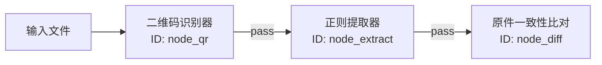

# 逻辑图变量传递与数据流配置指南 (Logic Graph Variables Data Flow Guide)

在 PPAP 平台的“高级自定义配置（逻辑图编排）”中，节点之间的数据流和变量传递是实现复杂多步校验的核心。本指南阐述了节点变量的运行机制、引用语法以及最佳实践。

---

## 1. 变量传递核心机制

逻辑图执行时，引擎通过一个共享的 `DocumentContext` 维护状态。数据流有两种存储和解析作用域：

1.  **全局共享状态 (Global Shared State)**：
    *   **作用域**：全局可用，存放如文件信息、扫描到的二维码数组等原始数据。
    *   **语法**：`{{变量名}}`
    *   **示例**：`{{qr_content}}` (首个二维码内容), `{{institution}}` (识别到的机构名)

2.  **节点输出状态 (Node Outputs)**：
    *   **作用域**：局限于特定节点，由上游节点执行完毕后输出。
    *   **语法**：`{{#node_id.key#}}`（注意包含前导 `#` 号）
    *   **示例**：`{{#node_extract.report_number#}}` (从 ID 为 `node_extract` 的正则提取器中获取名为 `report_number` 的变量)

---

## 2. 节点变量引用语法规范

当您在配置下游节点（如 HTTP 节点或 Diff 比对节点）的输入框时，可使用以下占位符来实现动态参数插值：

### A. 基础全局插值
*   **适用节点**：任何节点
*   **输入示例**：`http://api.example.com/check?type={{file_type}}`
*   **解析结果**：`{{file_type}}` 会被直接替换为当前上下文中的文件类型（如 `quality_report`）。

### B. 节点路径精确插值 (Dify 风格)
*   **适用节点**：需要引用上游特定节点输出的场景
*   **输入示例**：`http://mock-server/docs/{{#node_extract.report_number#}}?code={{#node_extract.verification_code#}}`
*   **注意点**：必须确保逻辑图中的连线正确，使上游节点先于当前节点执行。

### C. 数组与嵌套路径解析 (支持 `.` 分隔)
*   如果上游输出为 JSON 对象，可以使用 `.` 逐层解析：
    *   `{{#node_http.response_json.data.status#}}`
*   对于数组格式，需配合特定算子先进行扁平化，或使用 `shared_state` 的内置代理键（例如系统会自动将第一个数字签名信息代理至 `{{signer_cn}}`）。

---

## 3. 典型应用场景与节点配置示例

### 场景一：二维码 -> 正则提取器 -> 远程原件比对
这是最常用的在线防伪流。

1.  **正则提取器节点 (`node_extract`) 配置**：
    *   数据来源：`qr_content`
    *   正则表达式：`No:(?P<report_number>\d+);Code:(?P<verification_code>[A-Z0-9]+)`
    *   *注：正则表达式中的命名捕获组 `(?P<name>...)` 会自动映射为该节点的输出变量。*
2.  **原件一致性比对节点 (`node_diff`) 配置**：
    *   比对原件 URL：`http://mock-server/docs/{{#node_extract.report_number#}}?code={{#node_extract.verification_code#}}`

---

## 4. 调试与排错 (FAQ)

#### Q1: 下游节点提示“变量未找到 (Variable not found)”？
1.  **检查连线**：确认在逻辑图编辑器中，上游节点到下游节点之间有导向折线连接。
2.  **核对 ID**：双击上游节点，确认其 ID 确实为 `node_extract`（注意大小写及下划线），且表达式完全一致。
3.  **变量拼写**：确保命名捕获组的名字（如 `report_number`）与下游引用时一致。

#### Q2: 嵌套 JSON 结构如何安全提取？
对于 HTTP 响应等复杂的嵌套结构，推荐先在 HTTP 算子中配置 `json_path` 过滤出目标节点，或者在下游使用大模型算子进行语义提取，再进行变量传递。
